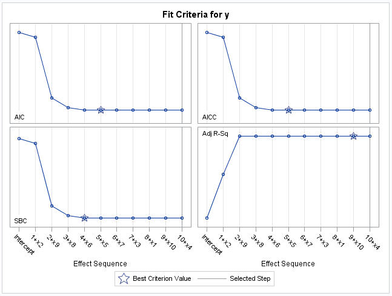
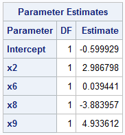
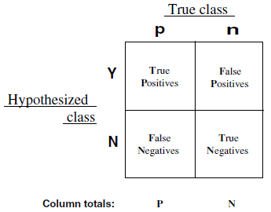
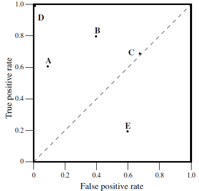

```{r, echo=FALSE}
knitr::opts_chunk$set(echo = TRUE, fig.align="center")
```

\newpage
# Aufgabe 2
Um ein das beste Modell wählen zu können, wurden drei unterschiedliche Methoden verwendet. Zu Beginn wurde die Methode Best-Sub-Selection betrachtet, danach die Lasso Regression und als letztes die Hauptkomponentenanalyse. Alle drei Verfahren zielen auf eine Reduktion der Dimensionen.

## Best-Sub-Selection

```{r, echo=FALSE, warning=FALSE}
library(ggplot2)
score <- c(110.1868, 110.1381, 109.7052, 109.0979, 107.0997, 106.5698, 100.6671, 95.4420, 88.9431, 81.3070)
number <- c(10,9,8,7,6,5,4,3,2,1)
df <- data.frame(score = score, number = number)

ggplot(df, aes(x = number, y = score)) + geom_point() + 
  ggtitle("Ergebnis Chi-Square") +
  xlab("Anzahl der Prädiktoren") + ylab("Ergebnis")

```


## Lasso Regression

Die \autoref{fig:lasso_criteria_for_y} zeigt die Bestimmtheitsmaße \textit{AIC}, \textit{AICC}, \textit{SBC}, \textit{Adj R-Sq}. 





\newpage
# Aufgabe 3
## Zusammenfassung – An introduction to ROC analysis

Tom Fawcett führt den ROC-Chart (Receiver Operating Characteristic oder dt. Grenzwertoptimierungskurve) zum Jahre 1975 zurück. Nach der geschichtlichen Exkursion wird festgestellt, dass der ROC-Chart in den vergangenen Jahren immer präsenter wird.



m den ROC-Chart besser zu verstehen, wird zunächst die Vier-Felder-Matrix (Siehe \autoref{fig:four-field-matrix}) eingeführt. Diese 2x2 Matrix beinhaltet zwei Spalten, die die wahre Klassifizierung, und zwei Zeilen, die die Hypothesenklassen beinhalten. Dabei beinhaltet die wahre Klassifizierung die echte Zuordnung zur Klasse und die Hypothesenklasse die Zuordnung durch ein Modell. Dabei gilt zu beachten, dass die folgenden zwei Formeln aus der Vier-Felder-Matrix für den ROC-Chart relevant sind.

$$tp\ rate = \frac{top}{p}, fp\ rate = \frac{fp}{n}$$

Der ROC-Chart (siehe \autoref{fig:roc-graph}) ist ein zweidimensionaler Graph, der auf der y-Achse die Werte der tp rates und auf der x-Achse fp rate visualisiert. Alle Werte eines Klassifikators über der gestrichelten Diagonalen konnten durch das Model positiv klassifiziert werden. Befindet sich ein Klassifikator auf der Diagonalen, könnte die Zuweisung der Werte auch zufällig entstanden sein. D.h. wenn ein Klassifikator auf der Diagonalen liegt, enthält er mit großer Wahrscheinlichkeit keine nützlichen Informationen. Der untere Teil bedeutet, dass der Klassifikator schlechter als zufällig abschneidet. Eine Möglichkeit Informationen aus den unteren Teil zu gewinnen, besteht darin die Klassifikatoren zu negieren. Das übergeordnete Ziel des Graphens ist das Erkennen, welche Klassifikatoren nützlich sind. Besonders gewinnbringend sind die Klassifikatoren in der linken oberen Ecke (0,1).




# Aufgabe 5_u
## Logistische Regression
## Schrittweise Logistische Regression


